# AgentUnlearn

<p align="center">
  <b>Agent-Centric Machine Unlearning for Multi-Agent LLM Systems</b>
</p>

<p align="center">
  <i>When one agent forgets, can the rest of the system teach it back?</i>
</p>

<p align="center">
  <a href="#key-result">Key Result</a> •
  <a href="#method">Method</a> •
  <a href="#experiments">Experiments</a> •
  <a href="#figures">Figures</a> •
  <a href="#reproducibility">Reproducibility</a> •
  <a href="#repository-structure">Structure</a>
</p>

---

## Overview

**AgentUnlearn** studies machine unlearning in **multi-agent LLM systems**, where knowledge is not only stored in model parameters but can also re-enter an agent through:

- peer messages,
- shared scratchpads,
- sequential reasoning chains,
- hierarchical aggregation,
- external context,
- agent memory.

The central question is:

> **Does successful forgetting by one designated agent imply forgetting by the multi-agent system as a whole?**

Our experiments show that the answer is generally **no**.

A target agent can exhibit substantially reduced recall after local suppression, while otherwise unchanged peers still retain enough information to **reconstruct or reintroduce the forgotten knowledge through interaction**.

AgentUnlearn therefore evaluates forgetting at two distinct levels:

- **Target-agent forgetting** — can the designated agent still recover the information?
- **System-level forgetting** — can the multi-agent system collectively reconstruct it?

This distinction exposes a failure mode that is invisible in conventional single-model unlearning evaluations.

---

## Key Result

The most important comparison isolates the effect of communication:

```text
target_context_memory
        ↓
    + communication filtering
        ↓
full_inference
```

Both conditions already suppress target-side context and memory. The difference is whether information transmitted through communication channels is additionally filtered.

### Calibrated main result

| Metric | Local suppression | + Communication filtering | Δ | Holm-adjusted p |
|---|---:|---:|---:|---:|
| **Target DRR** | 64.18% | **46.84%** | **−17.33 pp** | **3.47 × 10⁻⁹** |
| **Target IRR** | 61.44% | **54.46%** | **−6.97 pp** | **1.20 × 10⁻⁴** |
| Target retention | 81.07% | 80.44% | −0.62 pp | 1.00 |
| System DRR | 75.56% | 74.93% | −0.62 pp | 1.00 |
| System IRR | 69.03% | 68.72% | −0.31 pp | 1.00 |
| System retention | 85.60% | 85.42% | −0.18 pp | 1.00 |

### Interpretation

Communication filtering causes a **large additional reduction in reconstruction at the designated target agent**, while producing essentially no measurable change in:

- system-level direct reconstruction,
- system-level indirect reconstruction,
- target retention,
- system retention.

This is consistent with a **knowledge-routing effect**:

> communication-aware defense restricts the path by which forgotten information can re-enter the target agent, rather than simply destroying knowledge everywhere in the system.

---

## Visual Summary

<p align="center">
  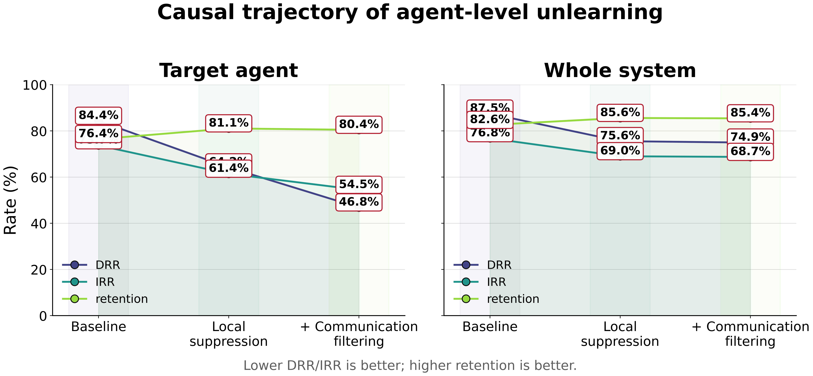
</p>

<p align="center">
  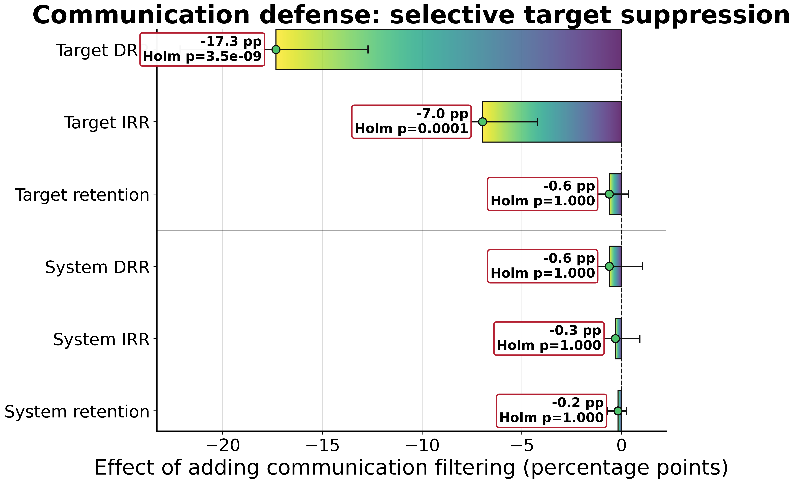
</p>

---

# Method

## Agent-centric unlearning

Consider a multi-agent system with a designated target agent \(a_t\).

The target contains knowledge to be forgotten, while other agents may remain unchanged.

We evaluate whether knowledge suppression survives interaction.

Let

\[
R_t
\]

denote reconstruction by the target agent and

\[
R_s
\]

denote reconstruction anywhere in the system.

A successful local intervention may reduce

\[
R_t
\]

without equivalently reducing

\[
R_s.
\]

The difference

\[
A = R_s - R_t
\]

can be interpreted as **reconstruction amplification**: information unavailable to the target locally but recoverable through the surrounding system.

---

## Multi-agent topologies

AgentUnlearn evaluates five interaction structures.

### Independent

Agents operate independently.

This acts as an important **mechanism-aligned negative control**: communication filtering should have no effect when no information is exchanged.

### Sequential

Information propagates through a chain of agents.

```text
Agent 1 → Agent 2 → Agent 3 → Target
```

### Debate

Agents exchange multiple rounds of arguments before producing a response.

```text
Agent A ↔ Agent B ↔ Agent C
              ↓
            Target
```

### Shared Scratchpad

Agents write information into shared intermediate state accessible by other agents.

```text
Agent A ─┐
Agent B ─┼── Shared Scratchpad ── Target
Agent C ─┘
```

### Hierarchical

Information is aggregated through a hierarchical structure before reaching the target.

```text
Agents
  ↓
Intermediate aggregation
  ↓
Target / coordinator
```

---

## Intervention space

The inference-time factorial includes:

| Intervention | Target context | Target memory | Communication |
|---|:---:|:---:|:---:|
| `none` | ✓ | ✓ | ✓ |
| `target_context` | ✗ | ✓ | ✓ |
| `target_memory` | ✓ | ✗ | ✓ |
| `communication` | ✓ | ✓ | filtered |
| `target_context_memory` | ✗ | ✗ | ✓ |
| `target_context_comm` | ✗ | ✓ | filtered |
| `target_memory_comm` | ✓ | ✗ | filtered |
| `full_inference` | ✗ | ✗ | filtered |
| `global_context` | global manipulation | — | — |

The primary causal comparison is:

```text
target_context_memory  →  full_inference
```

because target-local evidence is suppressed in both conditions.

---

# Metrics

## Direct Recall Rate — DRR

Measures whether the requested forgotten fact can be directly reconstructed.

Lower is better after unlearning.

---

## Indirect Reconstruction Rate — IRR

Measures whether semantically related or indirect probes recover the forgotten information.

Lower is better.

---

## Retention

Measures performance on unrelated retained knowledge.

Higher is better.

---

## Reconstruction Amplification

We additionally analyze the gap

\[
\text{Amplification} =
R_{\text{system}} -
R_{\text{target}}.
\]

A large positive value indicates that information suppressed at the designated target remains accessible elsewhere in the system.

---

# Experiments

The completed experimental plan contains:

| Component | Jobs / conditions |
|---|---:|
| Main factorial | 2,025 |
| Large-scale confirmation | 225 |
| Coder scale ablation | 405 |
| Additional ablations | 330 |
| Parameter-unlearning evaluation | 200 |
| Parameter-unlearning training | 20 |
| Robustness experiments | 500 |
| WMDP appendix | 36 |
| **Inference conditions** | **3,721** |
| **Total jobs including training** | **3,741** |

All **3,721 / 3,721 inference conditions** and **20 / 20 training jobs** completed successfully.

The calibrated scorer was subsequently applied to:

> **52,655 probe-level outputs**

without regenerating model responses.

---

# Models

Experiments cover several open-weight model scales and families.

### Main models

- Qwen3-4B
- Qwen3-8B
- Mistral-7B-Instruct-v0.3

### Large-scale confirmation

- Qwen3-14B

### Coder scale ablation

- Qwen2.5-Coder-1.5B-Instruct
- Qwen2.5-Coder-7B-Instruct
- Qwen2.5-Coder-14B-Instruct

---

# Benchmarks

## TOFU

Selective forgetting benchmark with multiple forget/retain partitions.

Used configurations include:

- forget01 / retain99
- forget05 / retain95
- forget10 / retain90

TOFU provides one of the clearest demonstrations of the distinction between target-level and system-level forgetting.

---

## RWKU

Real-world knowledge unlearning benchmark.

Multiple target entities are evaluated across direct, indirect, and retained knowledge probes.

---

## MUSE

Experiments include:

- MUSE-Books
- MUSE-News

MUSE is treated as a heterogeneous stress test because some subsets exhibit strong floor or retention effects.

---

## WMDP

WMDP-Bio and WMDP-Cyber are included as an appendix-level safety-oriented evaluation.

---

# Parameter-Level Unlearning

AgentUnlearn also supports interventions that modify the target agent's parameters while leaving peer agents unchanged.

Implemented approaches include:

- gradient-ascent-based unlearning,
- LoRA-based gradient-difference unlearning.

Parameter updates are activated only for calls to the designated target agent.

Peer agents continue using the original parameters.

This makes it possible to distinguish:

```text
target parameter modification
```

from

```text
system-wide model modification.
```

---

# Automatic Scorer Calibration

The original automatic criterion was intentionally conservative:

```text
exact
OR
(
    content_f1 >= 0.30
    AND
    semantic >= 0.50
)
```

To validate the scoring rule without manually relabeling tens of thousands of outputs, we constructed a 600-example calibration set containing both:

- target-agent responses,
- system responses.

The sample deliberately over-represents examples near the scorer decision boundary.

---

## Independent LLM-judge ensemble

Three independent local judge models were used:

- Qwen3-14B
- Mistral-7B-Instruct-v0.3
- Qwen2.5-Coder-14B-Instruct

Results:

```text
Calibration examples:        600
Consensus labels:            596
Unanimous labels:            555
```

Pairwise agreement:

| Judges | Agreement | Cohen's κ |
|---|---:|---:|
| Qwen3-14B / Mistral-7B | 95.45% | 0.855 |
| Qwen3-14B / Qwen2.5-Coder-14B | 97.31% | 0.908 |
| Mistral-7B / Qwen2.5-Coder-14B | 94.44% | 0.817 |

---

## Leakage-safe grouped calibration

Train/test separation is performed by semantic `probe_id`, rather than by individual prompt variant.

This prevents variants of the same underlying question from leaking between the calibration and evaluation sets.

Final calibrated decision rules:

```text
TARGET

exact
OR
(
    content_f1 >= 0.07
    AND
    semantic >= 0.23
)
```

```text
SYSTEM

exact
OR
(
    content_f1 >= 0.18
    AND
    semantic >= 0.18
)
```

Held-out performance:

| Side | Accuracy | Balanced accuracy | Precision | Recall | F1 | MCC |
|---|---:|---:|---:|---:|---:|---:|
| Target | 0.800 | 0.879 | 1.000 | 0.758 | **0.862** | 0.595 |
| System | 0.898 | 0.903 | 0.986 | 0.896 | **0.939** | 0.660 |

The original `0.30 / 0.50` rule had near-perfect precision but substantially lower recall.

---

<p align="center">
  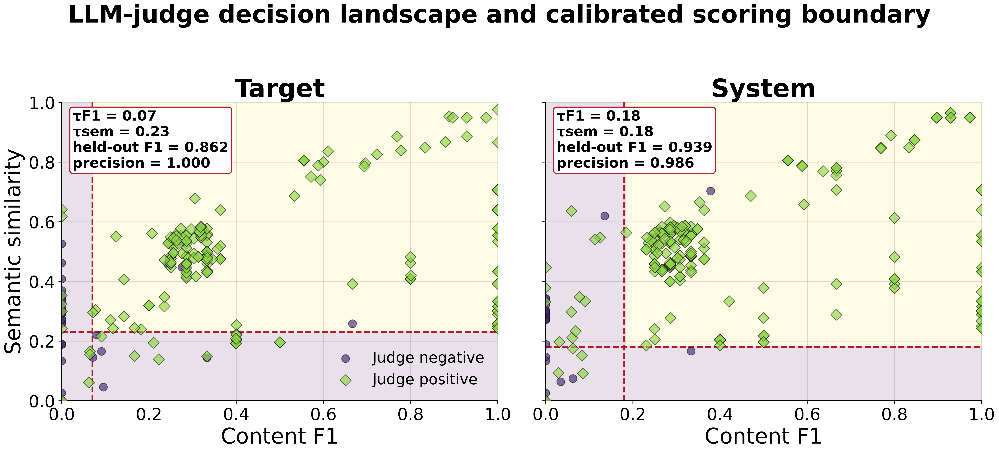
</p>

---

# Confirmatory Statistical Analysis

Three pre-specified causal contrasts are evaluated:

1. **Local suppression**

```text
none
→ target_context_memory
```

2. **Communication defense**

```text
target_context_memory
→ full_inference
```

3. **Total defense**

```text
none
→ full_inference
```

Each contrast is tested on six outcomes:

- target DRR,
- target IRR,
- target retention,
- system DRR,
- system IRR,
- system retention.

This gives a confirmatory family of:

> **3 × 6 = 18 tests**

with Holm correction applied over the entire family.

---

## Local suppression

| Metric | Before | After | Δ |
|---|---:|---:|---:|
| Target DRR | 84.36% | 64.18% | **−20.18 pp** |
| Target IRR | 73.74% | 61.44% | **−12.31 pp** |
| Target retention | 76.44% | 81.07% | +4.62 pp |
| System DRR | 87.47% | 75.56% | **−11.91 pp** |
| System IRR | 76.82% | 69.03% | **−7.79 pp** |
| System retention | 82.58% | 85.60% | +3.02 pp |

Local suppression therefore reduces reconstruction substantially, but does not guarantee system-wide forgetting.

---

## Communication defense

The communication layer produces a highly selective effect.

### Target

```text
DRR: 64.18% → 46.84%
Δ = −17.33 pp
Holm p = 3.47 × 10⁻⁹
```

```text
IRR: 61.44% → 54.46%
Δ = −6.97 pp
Holm p = 1.20 × 10⁻⁴
```

### System

```text
DRR: Δ = −0.62 pp
IRR: Δ = −0.31 pp
```

Neither system-level change survives correction.

Retention is also essentially unchanged.

This pattern is the main empirical evidence for the distinction between:

> **agent-level accessibility**

and

> **system-level knowledge possession**.

---

## Total defense

Relative to no intervention:

| Metric | Baseline | Full defense | Δ |
|---|---:|---:|---:|
| Target DRR | 84.36% | 46.84% | **−37.51 pp** |
| Target IRR | 73.74% | 54.46% | **−19.28 pp** |
| Target retention | 76.44% | 80.44% | +4.00 pp |
| System DRR | 87.47% | 74.93% | **−12.53 pp** |
| System IRR | 76.82% | 68.72% | **−8.10 pp** |
| System retention | 82.58% | 85.42% | +2.84 pp |

---

# Topology Matters

Communication-mediated reconstruction strongly depends on system structure.

The **Independent** topology is particularly important:

> communication filtering produces essentially no effect when agents do not exchange information.

This provides a mechanism-aligned negative control.

By contrast, larger effects are observed in communication-heavy structures such as:

- Sequential,
- Debate,
- Shared Scratchpad.

---

<p align="center">
  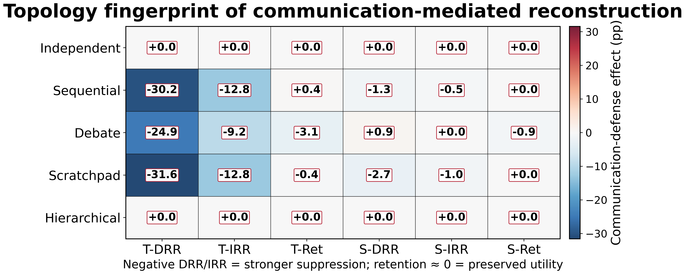
</p>

---

# Reconstruction Amplification

A central phenomenon in the experiments is that system-level knowledge can remain available even when target-agent accessibility falls sharply.

This is visualized through the system-target reconstruction gap.

<p align="center">
  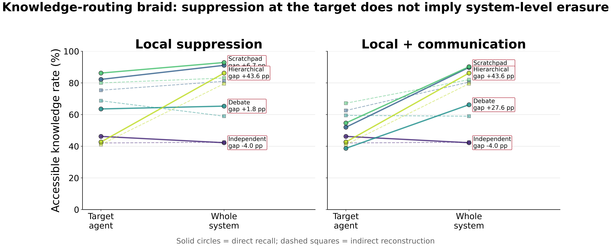
</p>

<p align="center">
  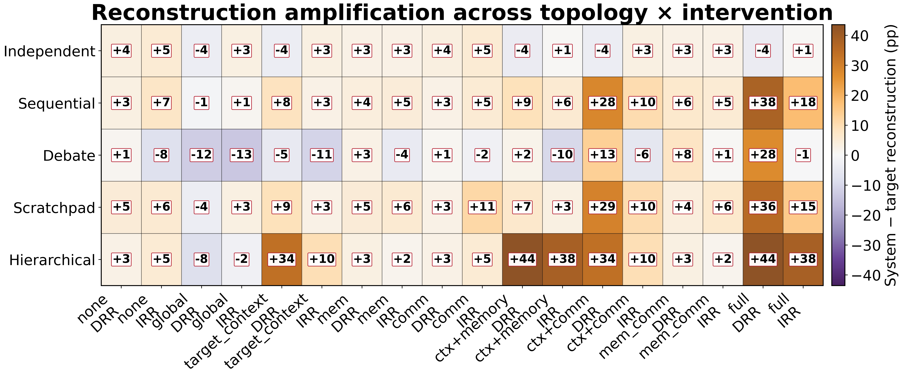
</p>

The widening gap between target and system accessibility is evidence that forgetting in an interacting system cannot always be characterized by inspecting a single agent in isolation.

---

# Intervention Landscape

AgentUnlearn evaluates inference interventions as a factorial system rather than as isolated baselines.

<p align="center">
  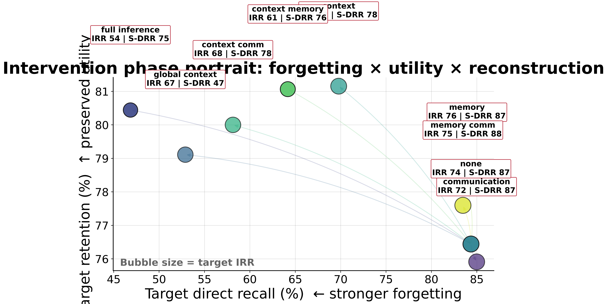
</p>

<p align="center">
  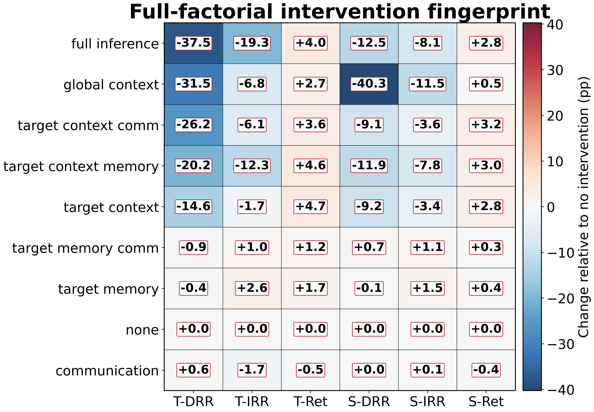
</p>

The phase portrait jointly visualizes:

- target direct reconstruction,
- target indirect reconstruction,
- retained utility,
- system accessibility.

This makes it possible to identify interventions that suppress target reconstruction without globally degrading the system.

---

# Cross-Model and Cross-Benchmark Analysis

<p align="center">
  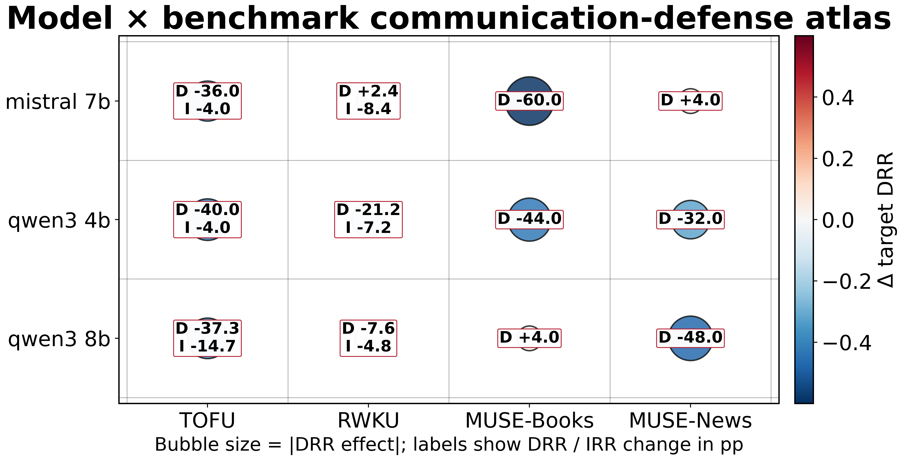
</p>

Communication-mediated reconstruction is not uniform across datasets or model families.

The repository therefore contains disaggregated analyses by:

- model,
- benchmark,
- topology,
- intervention,
- parameter method,
- robustness condition.

---

# Threshold Robustness

The primary conclusion does not depend on a single arbitrarily selected scoring threshold.

A large two-dimensional sensitivity sweep varies:

- content-F1 threshold,
- semantic-similarity threshold.

Each point measures the communication-defense effect under a different scoring decision boundary.

<p align="center">
  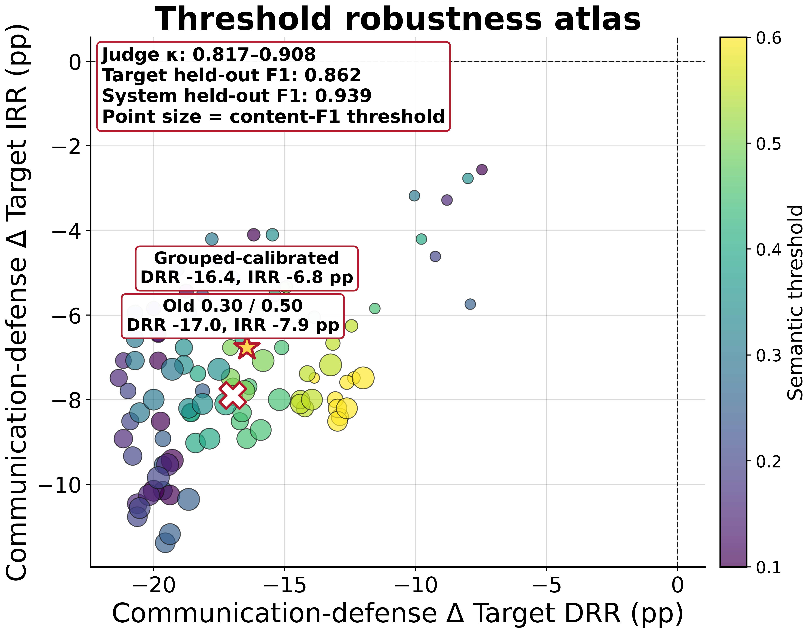
</p>

---

# Engineering / Runtime Analysis

AgentUnlearn also includes an engineering analysis of experimental cost.

The runtime tooling extracts available timing information from:

- experiment logs,
- raw JSON metadata,
- training summaries.

It aggregates runtime by:

- model,
- model size,
- benchmark,
- topology,
- intervention,
- parameter-unlearning method.

---

## Runtime distribution

<p align="center">
  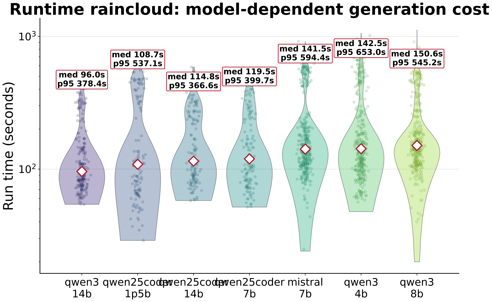
</p>

---

## Empirical model-size scaling

<p align="center">
  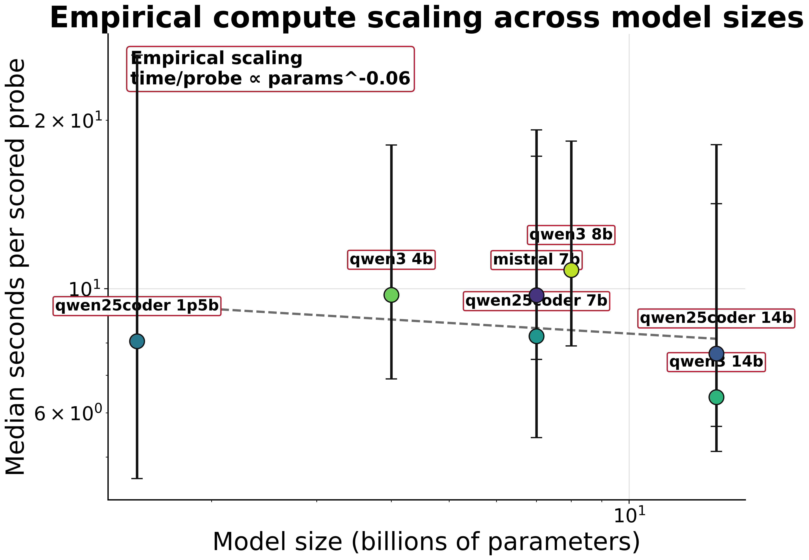
</p>

The runtime analysis estimates an empirical relation of the form

\[
t_{\mathrm{probe}}
\propto
P^{\alpha},
\]

where \(P\) is model parameter count.

---

## Topology × intervention computational overhead

<p align="center">
  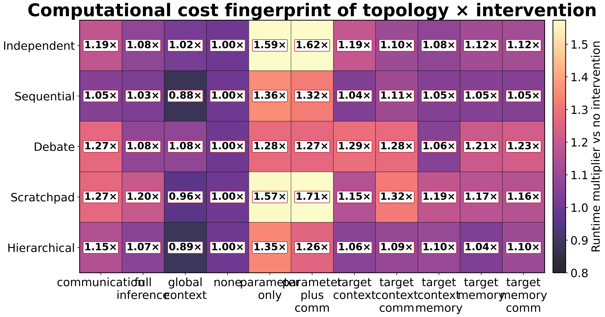
</p>

---

## Compute-effectiveness frontier

<p align="center">
  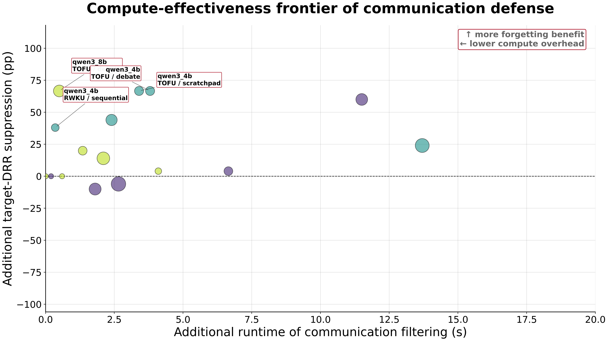
</p>

This analysis asks a practical question:

> **How much additional forgetting is obtained for the additional inference-time cost of communication filtering?**

The frontier compares:

- communication-defense runtime overhead,
- additional target DRR suppression,
- additional target IRR suppression.

---

# Figures

The repository contains publication-oriented vector PDF figures and high-resolution PNG previews.

```text
FIGURES/
├── 01_causal_trajectory.pdf
├── 02_communication_defense_forest.pdf
├── 03_topology_signature.pdf
├── 04_benchmark_signature.pdf
├── 05_model_and_parameter_landscape.pdf
├── 06_robustness_and_wmdp.pdf
├── 07_threshold_robustness_atlas.pdf
├── 08_knowledge_routing_braid.pdf
├── 09_reconstruction_amplification_matrix.pdf
├── 10_intervention_phase_portrait.pdf
├── 11_full_factorial_intervention_fingerprint.pdf
├── 12_model_benchmark_bubble_atlas.pdf
├── 13_judge_decision_landscape.pdf
├── 14_parameter_method_fingerprint.pdf
├── 15_parameter_training_dynamics.pdf
├── 16_runtime_raincloud_by_model.pdf
├── 17_runtime_scaling_law.pdf
├── 18_topology_intervention_runtime_matrix.pdf
└── 19_compute_effectiveness_frontier.pdf
```

Not every figure is necessarily intended for the main paper; the repository intentionally preserves a larger analysis set for appendices, ablations, and inspection.

---

# Reproducibility

## Environment

The experiments were executed with PyTorch/Transformers on an NVIDIA A100-class GPU environment.

A typical project environment can be activated as appropriate for the local installation.

The repository intentionally does **not** include model weights or benchmark datasets.

---

## Data layout

Expected external datasets are placed under:

```text
data/
├── TOFU/
├── RWKU/
├── MUSE-News/
├── MUSE-Books/
└── WMDP/
```

These directories are excluded from Git.

---

## Model layout

Local model checkpoints are expected under a model directory such as:

```text
models/
├── Qwen3-4B/
├── Qwen3-8B/
├── Qwen3-14B/
├── Mistral-7B-Instruct-v0.3/
├── Qwen2.5-Coder-1.5B-Instruct/
├── Qwen2.5-Coder-7B-Instruct/
└── Qwen2.5-Coder-14B-Instruct/
```

Model weights are excluded from the repository.

---

# Running the Experiment Plan

The production configuration is:

```text
AgentUnlearn_full_code/config/production.json
```

The full experiment manifest is stored under:

```text
manifests/runs_all.csv
```

Parameter-unlearning training jobs are stored separately:

```text
manifests/training_parameter_unlearning.csv
```

The experiment framework supports resumable execution and skips already completed runs.

Example:

```bash
cd AgentUnlearn_full_code

python -u run_full_plan.py
```

Exact entry points and configuration can also be inspected in the `scripts/` directory.

---

# Rebuilding Statistics

The complete statistics tree is stored under:

```text
STATS/
```

To rebuild aggregate statistics from completed runs:

```bash
cd AgentUnlearn_full_code

python -u scripts/build_all_stats.py
```

Major outputs include:

```text
STATS/
├── 00_snapshot/
├── 01_inventory/
├── 02_run_level/
├── 04_intervention_tests/
├── 05_parameter_unlearning/
├── 06_training/
├── 07_robustness/
├── 08_tables/
├── 09_paper_ready/
├── 10_calibration/
└── 11_final_paper/
```

---

# Automatic Judge Calibration

The ensemble calibration pipeline is implemented in:

```text
AgentUnlearn_full_code/scripts/auto_calibrate_judges.py
```

It performs:

```text
600 calibration examples
        ↓
3 independent LLM judges
        ↓
majority consensus
        ↓
grouped train/test split by probe_id
        ↓
2D content-F1 × semantic threshold search
        ↓
target/system-specific calibration
        ↓
52,655 probes rescored
        ↓
3,721 run-level metrics rebuilt
        ↓
18 confirmatory tests recomputed
```

Run:

```bash
cd AgentUnlearn_full_code

python -u scripts/auto_calibrate_judges.py
```

Judge outputs are resumable, so already evaluated examples are not regenerated.

---

# Rebuilding Figures

Main visual analysis:

```bash
cd AgentUnlearn_full_code

python -u scripts/make_final_wow_figures.py
```

Additional visualization suite:

```bash
python -u scripts/make_extra_wow_figures.py
```

Runtime analysis:

```bash
python -u scripts/build_runtime_atlas.py
```

Figures are written to:

```text
FIGURES/
```

---

# Runtime Statistics

Technical runtime artifacts are stored separately:

```text
TECH_STATS/
```

Examples include:

```text
run_runtime_master.csv
runtime_by_model.csv
runtime_by_topology.csv
runtime_by_intervention.csv
runtime_by_benchmark.csv
runtime_model_x_topology.csv
runtime_model_x_intervention.csv
runtime_topology_x_intervention.csv
paired_runtime_overhead.csv
communication_compute_effectiveness.csv
RUNTIME_SUMMARY.json
```

---

# Repository Structure

```text
AgentUnlearn/
│
├── AgentUnlearn_full_code/
│   ├── agentunlearn/
│   ├── config/
│   ├── scripts/
│   └── ...
│
├── manifests/
│   ├── runs_all.csv
│   └── training_parameter_unlearning.csv
│
├── outputs/
│   └── full_plan/
│       └── metrics/
│
├── STATS/
│   ├── 00_snapshot/
│   ├── 01_inventory/
│   ├── 02_run_level/
│   ├── 04_intervention_tests/
│   ├── 05_parameter_unlearning/
│   ├── 06_training/
│   ├── 07_robustness/
│   ├── 08_tables/
│   ├── 09_paper_ready/
│   ├── 10_calibration/
│   └── 11_final_paper/
│
├── FIGURES/
│
├── TECH_STATS/
│
├── scripts/
│
├── .gitignore
└── README.md
```

---

# What Is Not Stored in Git

To keep the repository lightweight and reproducible, Git excludes:

```text
data/
datasets/
models/
checkpoints/
outputs/full_plan/raw/
*.safetensors
*.pt
*.pth
*.bin
.venv/
```

The repository instead preserves:

- source code,
- configurations,
- experiment manifests,
- scorer outputs,
- aggregated metrics,
- statistical tests,
- calibration artifacts,
- plots,
- logs,
- lightweight reproducibility artifacts.

---

# Experimental Design at a Glance

```text
                  ┌────────────────────┐
                  │ Knowledge to forget│
                  └─────────┬──────────┘
                            │
                     local suppression
                            │
                            ▼
                    ┌───────────────┐
                    │ Target agent  │
                    └───────┬───────┘
                            │
            ┌───────────────┼────────────────┐
            │               │                │
            ▼               ▼                ▼
        Sequential        Debate        Scratchpad
            │               │                │
            └───────────────┼────────────────┘
                            │
                   peer information
                            │
                     reconstruction?
                            │
              ┌─────────────┴─────────────┐
              │                           │
              ▼                           ▼
       Target accessibility       System accessibility
              │                           │
              └─────────────┬─────────────┘
                            │
                 communication defense
```

---

# Main Takeaway

Machine unlearning becomes qualitatively different once models interact.

A designated agent can appear to forget a fact while the surrounding system still retains sufficient information to reconstruct it.

The experiments therefore support a distinction between:

```text
local forgetting
```

and

```text
system-level forgetting.
```

In particular:

> **Suppressing local context and memory reduces recall, but communication can reintroduce forgotten knowledge. Communication-aware filtering substantially reduces this reconstruction at the target agent while leaving system-level knowledge availability and unrelated retention largely unchanged.**

This suggests that machine unlearning for agentic systems should be evaluated not only at the parameter or single-model level, but across the **entire information-flow topology**.


The citation block will be updated with the final publication metadata.

---

# License

See the repository license for usage terms.

---

<p align="center">
  <b>AgentUnlearn</b><br>
  <i>Forgetting is not only about what an agent knows — it is also about what the system can teach back.</i>
</p>
